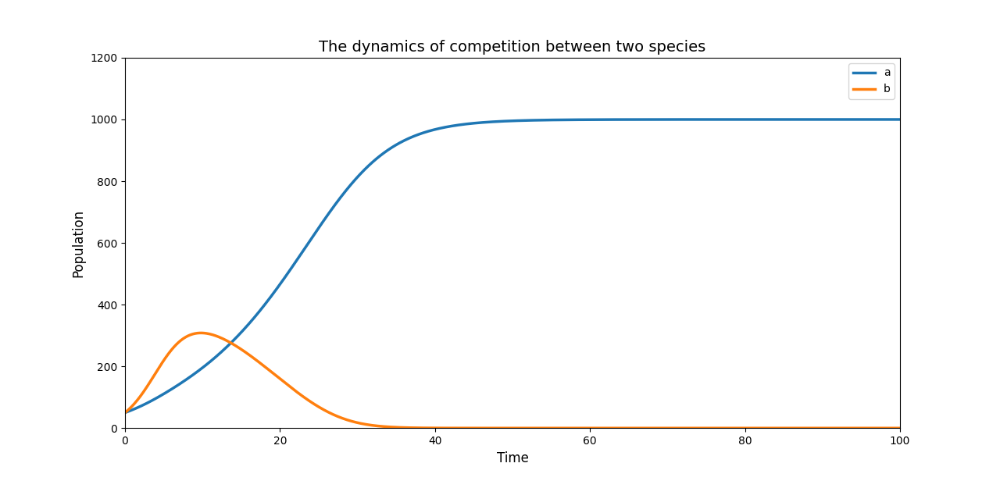
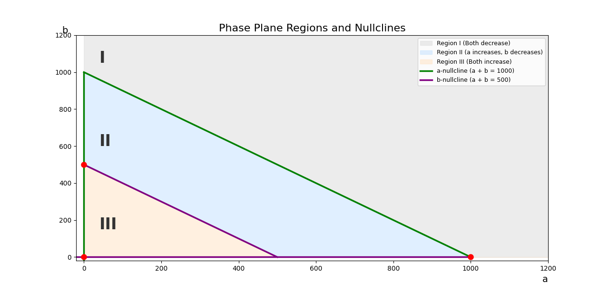

# Competition Model Analysis
# The Dynamics of Competition Between Two Species

## Overview
This model simulates the interaction between two competing species with population sizes $a(t)$ and $b(t)$ at a given time $t$. 

---

## 1. Exponential Growth Model (Independent)
In a scenario without resource limitation or competition, each species grows independently following basic exponential logic:

$$\frac{da}{dt} = \mu a$$
$$\frac{db}{dt} = \lambda b$$

---

## 2. The Coupled Competition Model
To make the model realistic, we introduce **Carrying Capacities** and **Interspecific Competition**. Because the two species compete for the same resources, their growth equations become coupled. The presence of one population directly reduces the available "room" for the other.

### Species a Growth
The growth of $a$ is constrained by its own density and the presence of species $b$:
$$\frac{da}{dt} = \mu a \left( 1 - \frac{a+b}{K_{a}} \right)$$
> *Note: Here, the term $(a+b)$ shows that species $b$ actively slows the growth of $a$.*

### Species b Growth
Similarly, the growth of $b$ is constrained by species $a$:
$$\frac{db}{dt} = \lambda b \left( 1 - \frac{a+b}{K_{b}} \right)$$
> *Note: Here, the term $(a+b)$ shows that species $a$ actively slows the growth of $b$.*
## The Competition Model Equations

To find the nullclines, we start by setting the population growth rates ($\frac{da}{dt}$ and $\frac{db}{dt}$) to zero.

**Species a:**
$$\frac{da}{dt} = 0.2a(1 - \frac{a+b}{1000}) = 0$$

**Species b:**
$$\frac{db}{dt} = 0.5b(1 - \frac{a+b}{500}) = 0$$

---

### 3. Carrying Capacities ($K_a$ and $K_b$)
These are the most important variables for the layout of the graph because they define the actual boundaries of the nullclines.

* **$K_a$ (Carrying Capacity of species a):** Determines the position of the **a-nullcline** (the line where $\frac{da}{dt} = 0$). By solving the equation, we get the line $a + b = 1000$. $K_a$ serves as both the x-intercept and the y-intercept for this boundary.
* **$K_b$ (Carrying Capacity of species b):** Dictates the position of the **b-nullcline** (the line where $\frac{db}{dt} = 0$). Solving this gives the line $a + b = 500$. $K_b$ serves as the intercepts for this line.

### 4. Growth Rates ($\mu$ and $\lambda$)
While they dictate how fast the populations multiply, they do not affect where the nullclines are drawn.

* **The Math:** In the model, the growth rates are $\mu = 0.2$ and $\lambda = 0.5$. Because the nullclines are found by setting the entire equation to $0$, the algebraic method divides both sides by the growth rate, removing it from the nullcline equations ($a+b=1000$ and $a+b=500$).
* **The Visual Effect:** Instead of moving the lines, these rates determine the behavior of the **direction arrows** inside the regions. They control the magnitude of the vectors—meaning they dictate how fast the populations increase or decrease in Regions I, II, and III.

